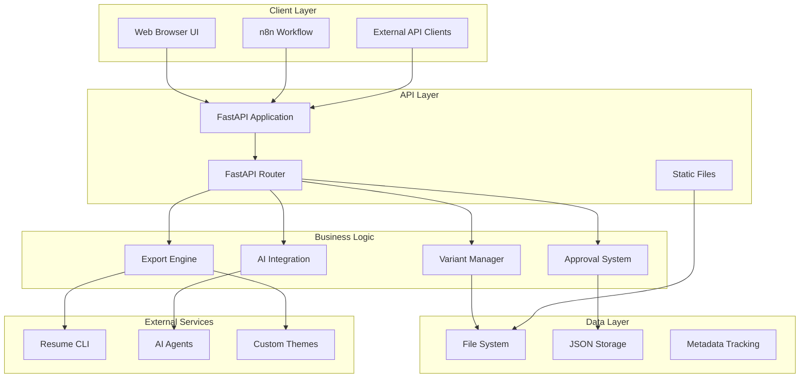
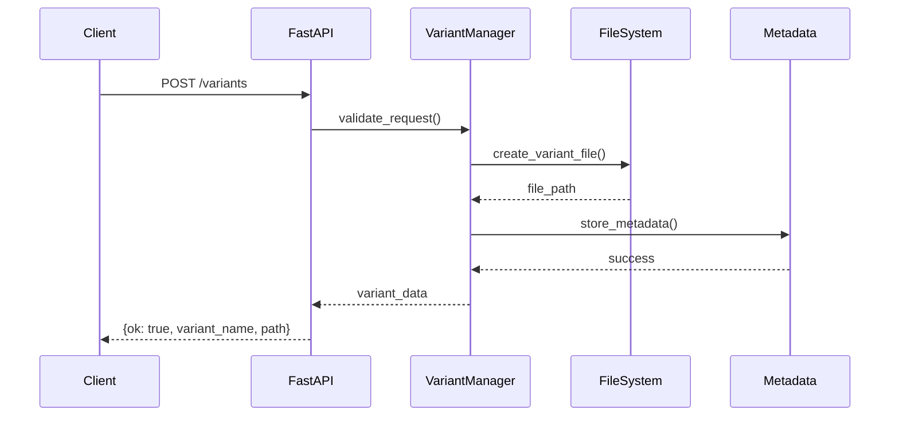
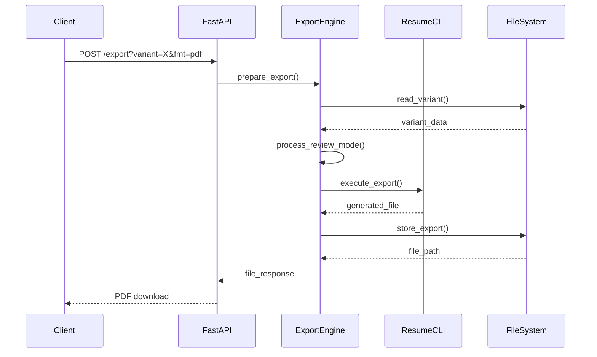
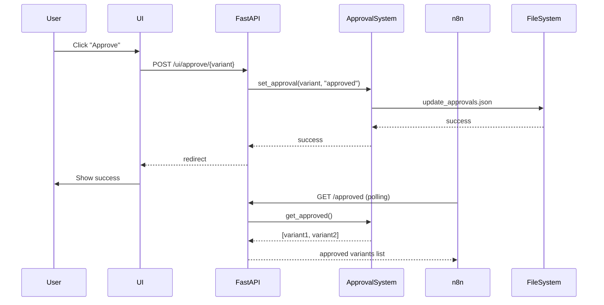
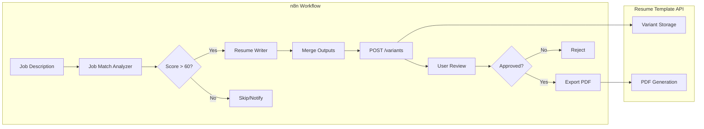
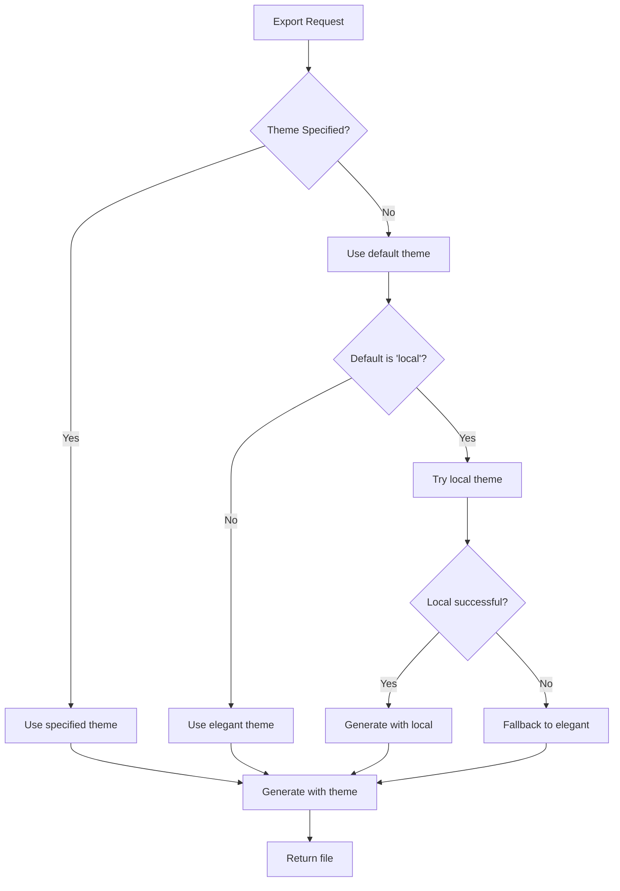

# Architecture Overview

This document provides a comprehensive overview of the Resume Template system architecture, including component interactions, data flow, and design decisions.

## 🏗️ System Architecture

### High-Level Architecture



## 📁 Component Breakdown

### 1. FastAPI Application (`app/main.py`)

**Purpose**: Main application entry point and API routing

**Key Responsibilities:**
- HTTP request handling and routing
- API endpoint implementation
- Response formatting and error handling
- Static file serving
- Template rendering for UI

**Core Components:**

#### Application Setup
```python
app = FastAPI(title="Resume API")
TEMPLATES = Jinja2Templates(directory=str(ROOT / "app" / "templates"))
```

#### Path Configuration
```python
ROOT = Path(__file__).resolve().parents[1]
BASE_PATH = ROOT / "resume.json"
VARIANTS_DIR = ROOT / "variants"
OUT_DIR = ROOT / "out"
APPROVALS_PATH = ROOT / "approvals.json"
```

### 2. Variant Management System

**Purpose**: Handle creation, storage, and retrieval of resume variants

**Data Flow:**
```
Request → Validation → Storage → Metadata → Response
```

**Key Functions:**

#### Create Variant
```python
def create_variant(req: CreateVariantRequest):
    """Create a new tailored resume variant (full JSON)."""
    variant_path = VARIANTS_DIR / f"{req.variant_name}.json"
    data = {
        "company_name": req.company_name,
        "resume": req.tailored_resume,
        "created_at": dt.datetime.utcnow().isoformat(),
        # ... additional metadata
    }
    write_json(variant_path, data)
    return {"ok": True, "variant_name": req.variant_name, "path": str(variant_path)}
```

#### Get Variant
```python
def get_variant(variant_name: str):
    """Get a tailored variant by name."""
    variant_path = VARIANTS_DIR / f"{variant_name}.json"
    if not variant_path.exists():
        raise HTTPException(404, f"Variant '{variant_name}' not found")
    return read_json(variant_path)
```

### 3. Export System

**Purpose**: Generate HTML and PDF exports from resume variants

**Architecture:**
```
Variant Data → Theme Selection → CLI Processing → File Generation
```

**Key Functions:**

#### Export Resume
```python
def export_resume(variant_name: str, fmt: str = "pdf", theme: Optional[str] = None, review: bool = False):
    """Export a variant resume as HTML or PDF with custom naming."""
    variant_data = get_variant(variant_name)
    resume_json = variant_data.get("resume")
    company = variant_data.get("company_name", "unknown")
    
    # Process for review mode vs final output
    output_json = json.loads(json.dumps(resume_json))  # deep copy
    if review and fmt == "html":
        output_json["_review_mode"] = True
        base = read_json(BASE_PATH)
        output_json["_base_resume"] = base
    else:
        # Clean final output: remove meta
        output_json.pop("meta", None)
    
    # Generate file using resume-cli
    filename = f"Abhijith_sivadas_moothedath_{company}.{fmt}"
    out_file = variant_dir / filename
    
    # Theme resolution with fallback
    chosen = theme or "local"
    # ... CLI execution logic
```

### 4. Approval Workflow System

**Purpose**: Manage approval states and provide UI for review

**Data Model:**
```python
class ApprovalStatus(BaseModel):
    variant: str
    status: str  # draft|approved|rejected
    updated_at: str
```

**Key Functions:**

#### Approval Management
```python
def get_approvals() -> Dict[str, ApprovalStatus]:
    """Load all approval statuses from approvals.json."""
    raw = read_json_safe(APPROVALS_PATH, {})
    out: Dict[str, ApprovalStatus] = {}
    for k, v in raw.items():
        try:
            out[k] = ApprovalStatus(**v)
        except Exception:
            out[k] = ApprovalStatus(variant=k, status="draft", updated_at=dt.datetime.utcnow().isoformat())
    return out

def set_approval(variant: str, status: str):
    """Update approval status for a variant (draft|approved|rejected)."""
    data = read_json_safe(APPROVALS_PATH, {})
    data[variant] = {
        "variant": variant,
        "status": status,
        "updated_at": dt.datetime.utcnow().isoformat(),
    }
    write_json(APPROVALS_PATH, data)
```

### 5. User Interface System

**Purpose**: Provide web-based interface for resume management

**Components:**
- **Index Template**: List all variants with status
- **Variant Template**: Detailed view with preview
- **Interview Prep Template**: Job analysis display

**Key Functions:**

#### UI Rendering
```python
@app.get("/ui", response_class=HTMLResponse)
def ui_index(request: Request):
    """Render main UI page listing all variants."""
    variants: List[str] = []
    if VARIANTS_DIR.exists():
        variants = [p.stem for p in VARIANTS_DIR.glob("*.json")]
    statuses = get_approvals()
    return TEMPLATES.TemplateResponse("index.html", {
        "request": request,
        "variants": sorted(variants),
        "statuses": statuses,
    })
```

#### Interview Preparation
```python
@app.get("/ui/variant/{variant}/interview-prep", response_class=HTMLResponse)
def ui_interview_prep(request: Request, variant: str):
    """Render interview preparation page for a variant."""
    variant_data = get_variant(variant)
    status = get_approvals().get(variant)
    
    context = {
        "request": request,
        "variant": variant,
        "company_name": variant_data.get("company_name", "Unknown"),
        "title_role": variant_data.get("title_role", "Unknown"),
        "verdict": variant_data.get("verdict"),
        "job_match_score": variant_data.get("job_match_score"),
        # ... additional context
    }
    
    return TEMPLATES.TemplateResponse("interview_prep.html", context)
```

## 🔄 Data Flow Patterns

### 1. Variant Creation Flow



### 2. Export Flow



### 3. Approval Workflow



## 🗄️ Data Storage Architecture

### File System Structure

```
resume_template/
├── resume.json              # Base/original resume (immutable)
├── variants/                # Generated variants
│   ├── abhijith_sivadas_moothedath_company1.json
│   ├── abhijith_sivadas_moothedath_company2.json
│   └── ...
├── out/                     # Exported files
│   ├── company1/
│   │   └── Abhijith_sivadas_moothedath_company1.pdf
│   └── company2/
│       └── Abhijith_sivadas_moothedath_company2.pdf
├── approvals.json           # Approval status tracking
├── .venv/                   # Python environment
├── theme-local/             # Custom resume theme
└── n8n_prompts/             # AI agent system prompts
```

### Data Models

#### Base Resume Structure
```json
{
  "$schema": "https://raw.githubusercontent.com/jsonresume/resume-schema/v1.0.0/schema.json",
  "basics": {
    "name": "Abhijith Sivadas Moothedath",
    "label": "Data Engineer",
    "email": "...",
    "phone": "...",
    "location": {...},
    "profiles": [...]
  },
  "work": [
    {
      "id": "metro",
      "name": "METRO Global Solution Center",
      "position": "Data Engineer",
      "location": "Bangalore, India",
      "startDate": "2024-07",
      "endDate": "2025-02",
      "highlights": [
        "Designed and maintained scalable ETL pipelines...",
        "Migrated over 45 TB of data with 96-100% accuracy..."
      ]
    }
  ],
  "education": [...],
  "skills": [...]
}
```

#### Variant Structure
```json
{
  "company_name": "SoSafe",
  "resume": {
    "$schema": "...",
    "basics": {
      "name": "Abhijith Sivadas Moothedath",
      "label": "Senior Data Engineer (m/f/d) Remote",
      ...
    },
    "work": [
      {
        "id": "metro",
        "name": "METRO Global Solution Center",
        "position": "Data Engineer",
        "highlights": [
          "Designed and maintained scalable ETL pipelines using Apache Airflow and dbt on AWS.",
          "Migrated over 45 TB of data with 96-100% accuracy using AWS DMS...",
          "Developed 20+ automated DAGs with CI/CD integration, improving performance by 40%."
        ]
      }
    ],
    "meta": {
      "modifications": {
        "work": {
          "metro": {
            "edited_bullets": [0, 1, 2]
          }
        }
      }
    }
  },
  "created_at": "2025-01-17T18:00:00.000Z",
  "job_match_score": 70,
  "verdict": "Moderate Match",
  "gaps": {
    "technical": ["AWS", "Kubernetes"],
    "domain": ["Fintech experience"],
    "soft_skills": []
  },
  "interview_tips": {
    "high_priority_topics": [...],
    "your_strengths_to_highlight": [...],
    "questions_to_ask": [...]
  }
}
```

## 🤖 AI Integration Architecture

### n8n Workflow Integration



### Agent System Prompts

The system uses three AI agents:

1. **Job Match Analyzer**: Analyzes candidate-job fit
2. **Resume Writer**: Creates tailored resumes based on analysis
3. **Resume Tailor** (Legacy): Direct tailoring without analysis

**Integration Points:**
- System prompts stored in `n8n_prompts/`
- JSON schema for API validation
- Workflow documentation in `AGENT_WORKFLOW.md`

## 🎨 Theme System Architecture

### Theme Resolution



### Custom Theme Structure

```
theme-local/
├── package.json          # Node.js package configuration
├── template.hbs          # Handlebars template
└── index.js              # Template compilation (optional)
```

## 🔧 Configuration Architecture

### Environment Configuration

```python
# Path Configuration
ROOT = Path(__file__).resolve().parents[1]
BASE_PATH = ROOT / "resume.json"
VARIANTS_DIR = ROOT / "variants"
OUT_DIR = ROOT / "out"
APPROVALS_PATH = ROOT / "approvals.json"

# Application Configuration
app = FastAPI(title="Resume API")
TEMPLATES = Jinja2Templates(directory=str(ROOT / "app" / "templates"))
```

### Runtime Configuration

- **Port**: Configurable via environment variable
- **Directories**: Relative to project root
- **Themes**: Resolved with fallback logic
- **File Storage**: Local file system (extensible to cloud storage)

## 🚀 Scalability Considerations

### Current Limitations
- File system storage
- Single-process architecture
- No database layer
- Synchronous file operations

### Scaling Opportunities
1. **Database Migration**: Replace JSON files with PostgreSQL/MongoDB
2. **Cloud Storage**: Move variants and exports to S3/Cloud Storage
3. **Caching**: Add Redis for frequent access patterns
4. **Load Balancing**: Deploy multiple instances behind load balancer
5. **Background Jobs**: Use Celery for heavy export operations

### Performance Optimizations
- Async file operations
- JSON caching for base resume
- Lazy loading for variant lists
- CDN for static exports

## 🔒 Security Architecture

### Current Security Measures
- Input validation via Pydantic
- Path sanitization
- No arbitrary code execution
- File system restrictions

### Security Enhancements
- API key authentication
- Rate limiting
- Input sanitization
- Audit logging
- HTTPS enforcement

## 📊 Monitoring & Observability

### Current Monitoring
- FastAPI built-in logging
- Error handling with HTTP exceptions
- File operation tracking

### Enhancement Opportunities
- Structured logging
- Performance metrics
- Health checks
- Error tracking
- Usage analytics

---

## 🔄 Future Architecture Evolution

### Phase 1: Enhanced Features
- Database integration
- User authentication
- Advanced search capabilities
- Version comparison tools

### Phase 2: Enterprise Scale
- Microservices architecture
- Cloud-native deployment
- Advanced caching
- Real-time collaboration

### Phase 3: AI Integration
- Direct AI agent integration
- Automated optimization
- Personalization engine
- Predictive analytics

---

*Last updated: 2025-01-17*